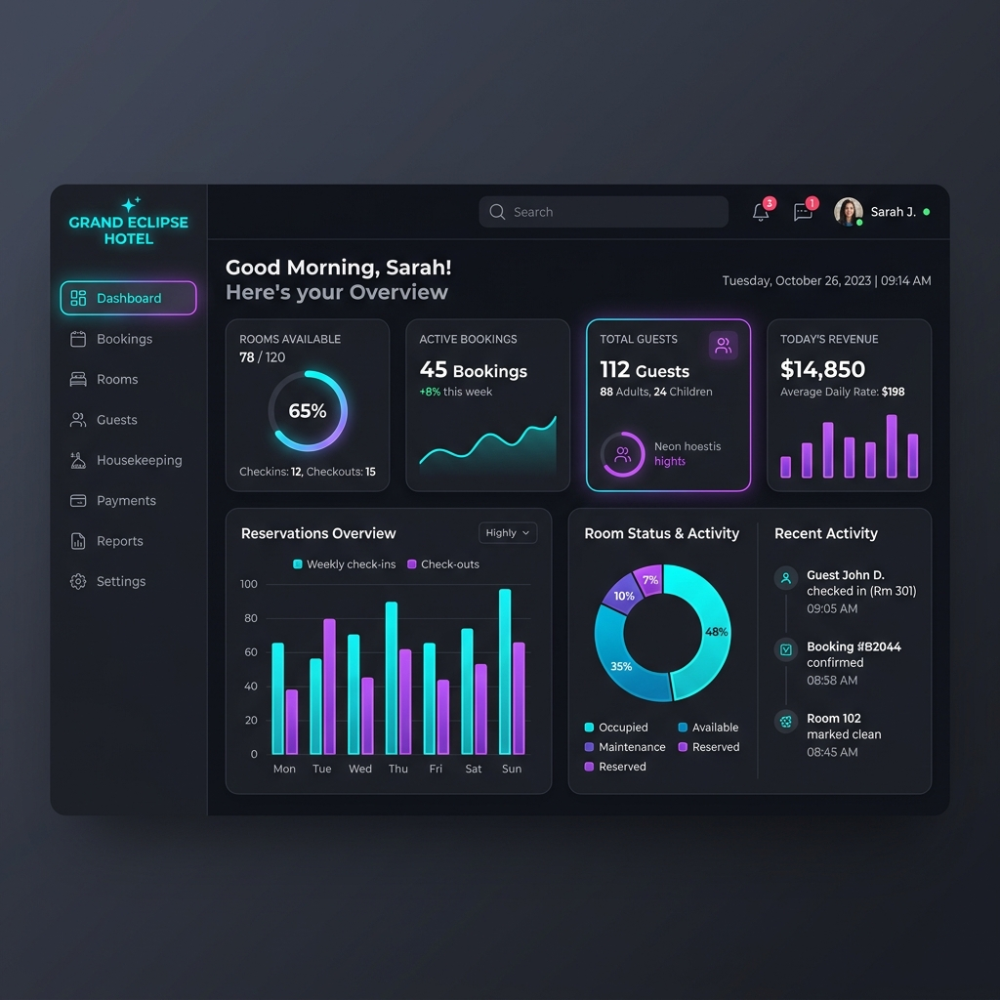

# 🏨 Otel Otomasyonu & Rezervasyon Yönetim Sistemi

C# Windows Forms ve MS SQL Server kullanılarak geliştirilmiş, modern görünümlü (DevExpress bileşenleri destekli) ve kapsamlı bir **Otel Otomasyonu & Rezervasyon Yönetim Sistemi**. 

Bu proje; otel yöneticilerinin odaları, kayıtları ve rezervasyonları kontrol edebilmesini sağlarken; müşterilerin de kendi hesaplarını yönetebilmesine, oda durumlarına göre rezervasyon yapabilmesine olanak tanır.

---

## 📸 Proje Ön İzleme



---

## 🌟 Öne Çıkan Özellikler

### 🔑 Gelişmiş Kimlik Doğrulama & Giriş Sistemi
* **Çift Rol Desteği:** Yönetici (Admin - Yetki: 1) ve Müşteri (User - Yetki: 0) olmak üzere iki farklı kullanıcı tipi.
* **Şifre Gizleme/Gösterme:** Kullanıcı dostu şifre güvenlik kontrolleri.
* **Akıllı Doğrulama:** Kayıt esnasında mükerrer TC Kimlik Numarası ve Kullanıcı Adı kontrolleri (Çakışmalar tamamen engellenmiştir).

### 🖥️ Yönetici (Admin) Paneli
* **Özet İstatistikler (Dashboard):** Oteldeki aktif rezervasyon sayısı, toplam oda sayısı ve kayıtlı müşteri sayısının dinamik olarak anlık listelenmesi.
* **Müşteri Kayıt Kontrolü:** Müşteri ekleme, silme, güncelleme ve detaylı arama paneli.
* **Oda Yönetim Paneli:** Odaların durumunu (DOLU/BOŞ) ve tipini (Tek Kişilik, Çift Kişilik, Aile vb.) yönetme ve güncelleme ekranı.
* **Rezervasyon Kontrol Paneli:** Tüm otel rezervasyonlarının genel tablosu ve yönetimi.

### 👤 Müşteri (Kullanıcı) Paneli
* **Rezervasyon Kontrolü:** Kullanıcı sisteme girdiğinde aktif bir rezervasyonu olup olmadığını gösteren akıllı karşılama ekranı.
* **Oda Seçim ve Rezervasyon:** Seçilen oda tipine göre veri tabanında sadece **"BOŞ"** durumda olan odaların otomatik listelenmesi ve rezervasyon yapılması.
* **Hesap Ayarları:** Müşterinin kendi bilgilerini güncelleme veya hesabını tamamen silebilme yetkisi.

---

## 🛠️ Kullanılan Teknolojiler

* **Yazılım Dili:** C# (.NET Framework)
* **Arayüz Teknolojisi:** Windows Forms, DevExpress Skins & LookAndFeel
* **Veritabanı:** MS SQL Server (ADO.NET - SqlClient)
* **Veritabanı Katmanı:** `SqlCommand`, `SqlDataReader`, `SqlDataAdapter` ve Parameterized Queries (Güvenli SQL sorguları için)

---

## 🗄️ Veritabanı Kurulumu (`otomasyon_otel_VT`)

Projenin çalışabilmesi için SQL Server üzerinde `otomasyon_otel_VT` adında bir veritabanı kurulması gerekmektedir. Veritabanı bağlantı dizesi (Connection String) C# sınıflarında şu şekildedir:

```csharp
"Data Source=GOGEBAKAN;Initial Catalog=otomasyon_otel_VT;Integrated Security=True"
```

> [!NOTE]  
> Kendi bilgisayarınızda çalıştırmadan önce `Data Source` alanını kendi SQL Server adınızla (örn: `localhost` veya `.` ya da bilgisayar adınız) güncellemeniz gerekmektedir.

### 📊 Veritabanı Tablo Yapıları

#### 1. `Kullanıcılar` Tablosu
Müşteri ve yöneticilerin kimlik ve giriş bilgilerini tutar:
* `tc_kimlik` (Primary Key - NVARCHAR)
* `isim` (NVARCHAR)
* `soyisim` (NVARCHAR)
* `cinsiyet` (NCHAR) -> `1` (Erkek), `0` (Kadın)
* `dogum_tarihi` (NVARCHAR)
* `tel_no` (NVARCHAR)
* `mail_adresi` (NVARCHAR)
* `kullanıcı_ad` (NVARCHAR - Unique)
* `sifre` (NVARCHAR)
* `yetki` (NCHAR) -> `1` (Yönetici), `0` (Müşteri)

#### 2. `Odalar` Tablosu
Otel odalarının durumunu takip eder:
* `oda_numarası` (Primary Key - NVARCHAR)
* `oda_tipi` (NVARCHAR)
* `oda_durumu` (NVARCHAR) -> `BOS`, `DOLU`

#### 3. `Rezervasyon` Tablosu
Aktif rezervasyon kayıtlarını tutar:
* `tc_kimlik` (Primary Key - NVARCHAR)
* `oda_no` (NVARCHAR)
* `oda_tipi` (NVARCHAR)
* `giris_tarihi` (NVARCHAR)
* `cıkıs_tarihi` (NVARCHAR)

---

## 📂 Proje Dizin Yapısı

```text
Otel-Otomasyonu/
│
├── otel_otomasyon/                     # Proje ana klasörü
│   ├── Resimler/                       # Uygulama ikonları ve ekran görüntüleri
│   │   └── hotel_dashboard_mockup.png
│   │
│   ├── Properties/                     # Proje özellikleri ve kaynak dosyaları
│   ├── Form_giris_ekranı.cs            # Giriş Formu (Entry point)
│   ├── Form_admin_menu.cs              # Yönetici Ana Menüsü
│   ├── Form_KAYIT.cs                   # Yönetici Müşteri Kontrol Formu
│   ├── Form_kisi_kayıt.cs              # Kayıt Formu Adım 1 (Kişisel Bilgiler)
│   ├── Form_kisi_kayıt2.cs             # Kayıt Formu Adım 2 (Hesap Bilgileri)
│   ├── Form_klnc_ayar.cs               # Müşteri Profil Ayarları Formu
│   ├── Form_klnc_rezervasyon.cs        # Müşteri Rezervasyon Ekranı
│   ├── Form_kullanıcı_menu.cs          # Müşteri Ana Menüsü
│   ├── Form_ODA.cs                     # Oda Yönetim Formu
│   ├── Form_REZERVASYON.cs             # Rezervasyon Yönetim Formu
│   ├── Program.cs                      # Uygulama başlangıç noktası
│   └── otel_otomasyon.csproj           # C# Proje Dosyası
│
├── otel_otomasyon.sln                  # Visual Studio Çözüm Dosyası
└── README.md                           # Proje Açıklama Dokümanı
```
